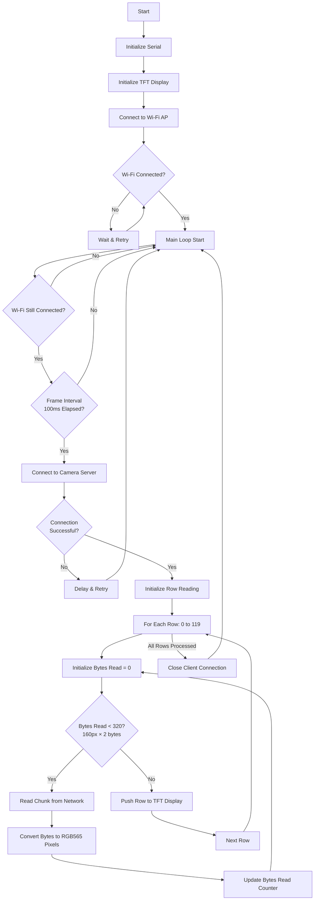
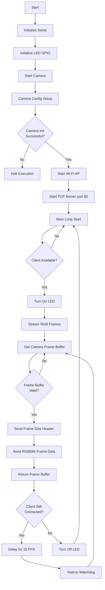

# ESP32-CAM 10 FPS Video Streaming Projects

**Author:** Araham Abeddin

This document explains how two projects work that enable **10 FPS video streaming** using an ESP32-CAM module and an ESP32 with a 1.8" TFT display.

---

## **About the Hardware**

### **ESP32-CAM**

* A low-cost development board with an integrated **camera module**.
* Capable of capturing images and video in RGB565 or JPEG formats.
* Can act as a Wi-Fi Access Point or connect to existing Wi-Fi networks.
* Supports TCP streaming for sending frames to clients.

### **ESP32 Module**

* A versatile microcontroller with Wi-Fi and Bluetooth connectivity.
* Used here to **receive video frames from ESP32-CAM** and drive the TFT display.
* Handles Wi-Fi communication, frame buffering, and display updates.

### **1.8" TFT LCD Display (ST7735)**

* Small SPI-based color display with **160x128 resolution**.
* Compatible with Adafruit GFX and ST7735 libraries.
* Can display RGB565 pixel data received from ESP32-CAM.
* Provides visual feedback of video streaming in real-time.

### **Wiring Diagram**

**ESP32 Module ↔ 1.8" TFT ST7735 Display (SPI)**

| TFT Pin | ESP32 Pin | Description          |
| ------- | --------- | -------------------- |
| VCC     | 3.3V      | Power supply         |
| GND     | GND       | Ground               |
| CS      | GPIO 5    | Chip select          |
| DC      | GPIO 2    | Data/Command control |
| RST     | GPIO 4    | Reset pin            |
| MOSI    | GPIO 23   | SPI data line        |
| SCK     | GPIO 18   | SPI clock line       |
| LED     | 3.3V      | Backlight (optional) |

---

## **Project 1: ESP32-CAM → TFT Display Streaming**

### **How It Works**

1. The ESP32-CAM captures video frames (160×120 resolution, RGB565 format).
2. The frames are sent over Wi-Fi to an ESP32 microcontroller connected to a TFT display.
3. The ESP32 reads the frame row by row and pushes it to the TFT display.
4. Frame rate control ensures video is displayed smoothly at 10 FPS.

### **Flow**

* Connect to Wi-Fi.
* Connect to the ESP32-CAM TCP server.
* Read frame in chunks and push to TFT.
* Repeat every 100ms for the next frame.

### **Code 1: TFT Display Client**

**Process Description**

* **Initialization Phase:**

  * Serial communication setup
  * TFT display initialization
  * Wi-Fi connection to ESP32-CAM AP
* **Main Loop Logic:**

  * Frame rate control (10 FPS)
  * Network connection management
  * Error handling for disconnections
* **Frame Processing:**

  * Row-by-row data reception
  * Chunk-based network reading (2KB chunks)
  * RGB565 data conversion
  * Real-time TFT display update

---

## **Project 2: ESP32-CAM Raw RGB Streaming Server**

### **How It Works**

1. ESP32-CAM is set up as an Access Point.
2. A TCP client connects (ESP32, Raspberry Pi, etc.).
3. ESP32-CAM captures frames (160×120, RGB565) and sends the raw data to the client.
4. The client can receive and display the frames.
5. Delay and `yield()` are used to prevent watchdog resets.

### **Flow**

* Start ESP32-CAM as an AP.
* Server listens on port 80.
* Frames are continuously sent once a client connects.
* Optional frame size header is sent so the client knows how much data to receive.

### **Code 2: Camera Server**

**Process Description**

* **Initialization Phase:**

  * Serial communication setup
  * Camera hardware initialization (AI-Thinker model)
  * Wi-Fi Access Point creation
  * TCP server startup
* **Camera Configuration:**

  * RGB565 pixel format
  * QQVGA resolution (160x120)
  * Single frame buffer
  * 20MHz clock frequency
* **Streaming Loop:**

  * Continuous frame capture
  * Raw RGB565 data transmission
  * Frame rate control (25 FPS)
  * Client connection monitoring
  * Watchdog timer management

---

## **Key Differences Between Codes**

| Aspect      | Code 1 (Client)            | Code 2 (Server)           |
| ----------- | -------------------------- | ------------------------- |
| Role        | Display Client             | Camera Server             |
| Function    | Receives & displays frames | Captures & streams frames |
| Network     | Connects as client         | Hosts as Access Point     |
| Output      | TFT Display                | Network Stream            |
| Frame Rate  | 10 FPS (display)           | 25 FPS (stream)           |
| Data Format | RGB565 processing          | RGB565 raw data           |

---

## **Summary**

* **Project 1**: ESP32-CAM streams video to an ESP32 TFT display.
* **Project 2**: ESP32-CAM acts as a server streaming raw RGB frames.
* RGB565 format is memory-efficient and frame rate control ensures smooth video.
* The combination of ESP32-CAM, ESP32 module, and 1.8" TFT display enables a compact, wireless video streaming solution.

---

## **License**

This project is licensed under the MIT License. You are free to use, copy, modify, and distribute the work for personal or commercial purposes with proper attribution to the author.

**Author:** Araham Abeddin
